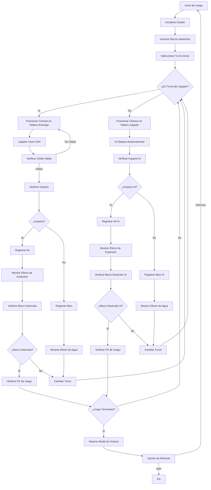
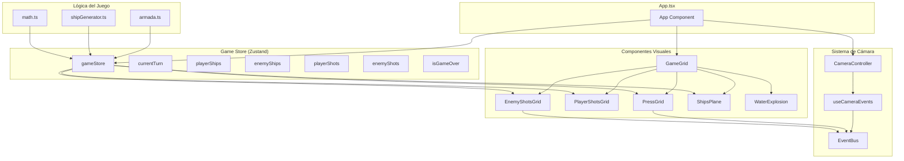
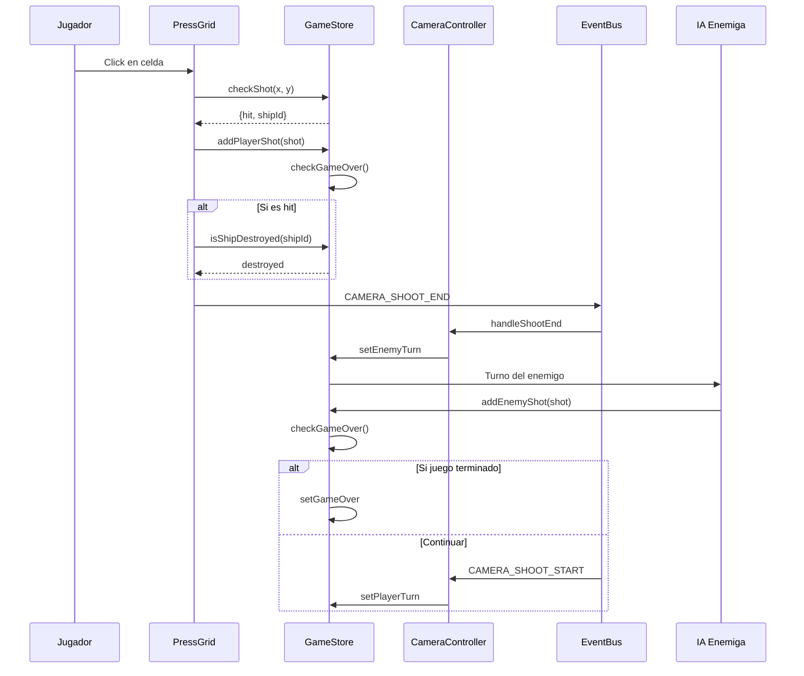
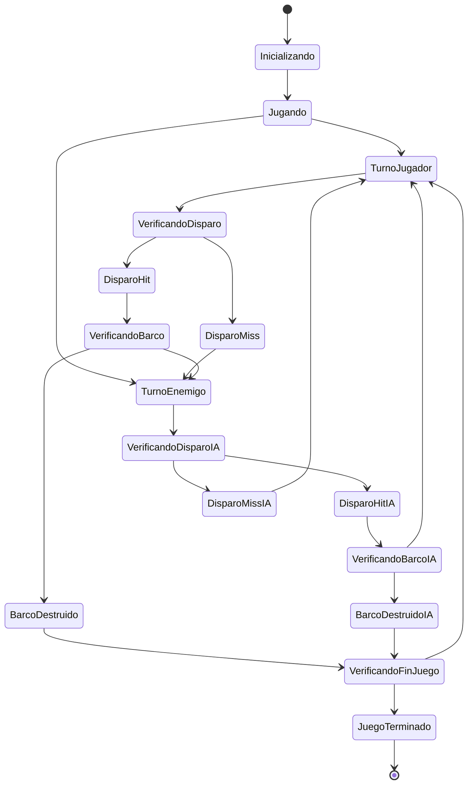
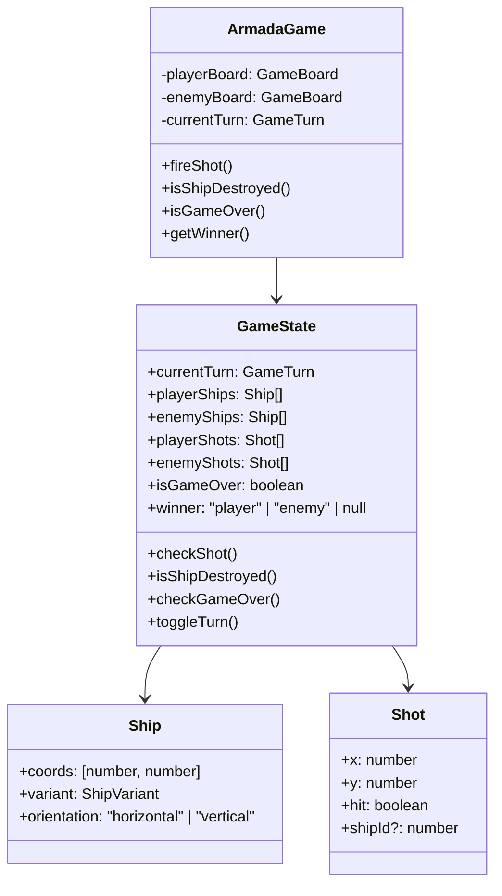
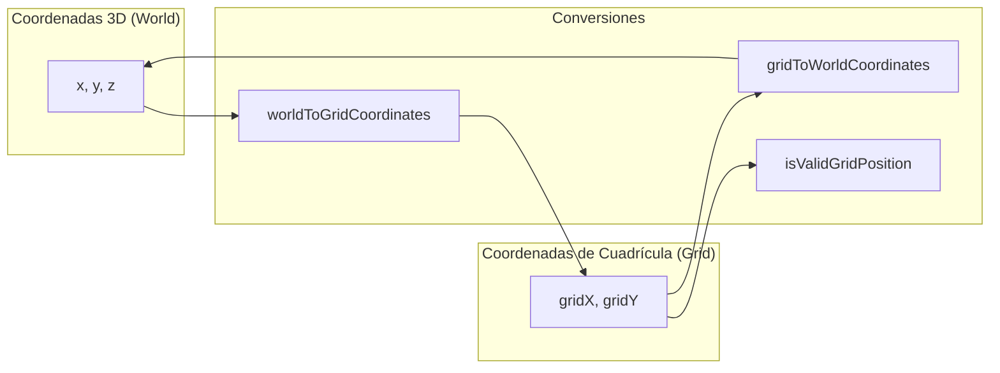
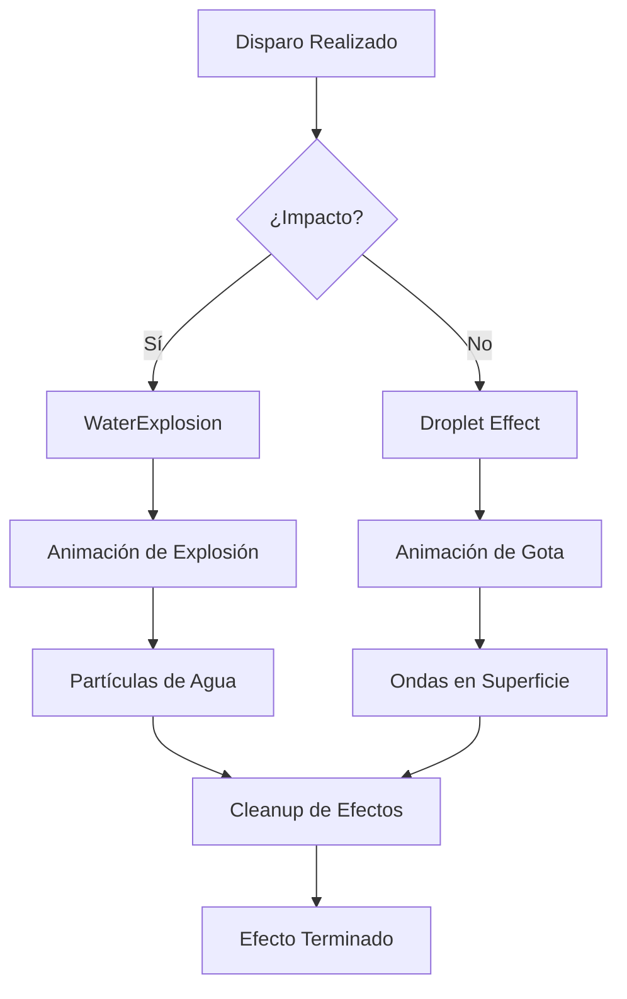
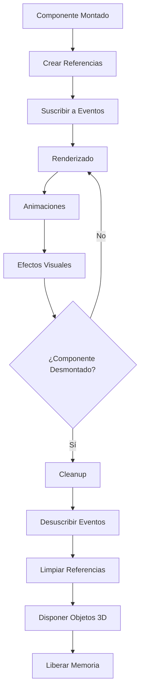

# Diagrama de Flujo de Armada.io

## Flujo Principal del Juego

## Arquitectura de Componentes

## Flujo de Eventos

## Estados del Juego

## Estructura de Datos

## Sistema de Coordenadas

## Flujo de Efectos Visuales

## Gestión de Memoria y Performance

